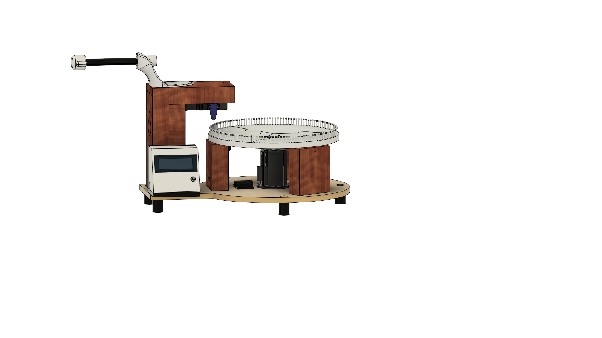

# StringArtRobot

### **\*Important\***
### This project is NOT completed, and is going through more revisions. I would not recommend building it, unless you've gone over everything and too agree it will work, even then that's do it at your own risk!

## About
This is a project to automatically make string art from an input image. I got the idea for this project from [this](https://www.youtube.com/watch?v=WGccIFf6MF8&ab_channel=VirtuallyPassed) YouTube video by [Virtually Passed](https://www.youtube.com/@virtually_passed).
The logic for generating the sequences is based off [this gist](https://gist.github.com/kaspermeerts/781f0137b361b51224dcab722ae387b4#file-stringart-py) by [kaspermeerts](https://github.com/kaspermeerts), implemented in my [threadArt python library](https://github.com/quintindunn/threadArt).

## Video
*Not created yet*

## Design

This project was modeled in Fusion360, with schematics made with EasyEDA (WIP)

## What you need to assemble this
**NOT A FULL LIST**
- 1x 2'x2' Sheet of 1/2" plywood
- 3x 4.25” long 2x4
- 2x 6” long 2x4
- 1x 8” 2x4
- 1x 9.5” 2x4
- Bunch of screws (Types not decided yet)
- 40mm x 0.45mm Sewing Needle
- Ender 3 Pro X-Axis stepper motor
- 3D printer & filament
- MG996R with circular horn
- Arduino Uno
- TMC2209 Stepper motor driver
- 12v 5a Power supply
- [Simthread Embroidery Thread](https://www.amazon.com/gp/product/B0BFWVR72D/ref=ppx_yo_dt_b_asin_title_o03_s00?ie=UTF8&th=1)

## Printing Instructions
Download the STL files from [/3d/StringBotV1](https://github.com/quintindunn/StringArtRobot/tree/main/3d/StringBotV1)  
Printed on an Ender 3 S1 Pro running octoprint.
### My general config, though check for any changes for the given part:
- Filament: Generic PLA
- Hotend Temperature: 200c
- Bed Temperature: 60c
- Infill: 20%
- Slicer: PrusaSlicer 2.5.2
- Supports: Off

### Part by part breakdown (INCOMPLETE)
| Name | Quantity | Material | Infill | Supports | Orientation |
|------|----------|----------|--------|----------|-------------|
| N/A  | N/A      | N/A      | N/A    | N/A      | N/A         |
